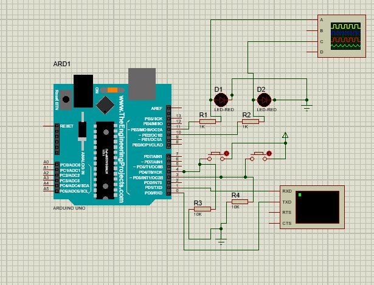

# Vehicle Indicator Control System

This project simulates a vehicle indicator system using an Arduino Uno and Bluetooth module in Proteus.

## Features
- Control left and right indicators using the push buttons.
- Blink indicators at regular intervals.
- UART logging of system state.
- Layered software architecture (BSW & ASW).

## Commands
| Command | Description |
|---------|-------------|
| LEFT | Activates left indicator |
| RIGHT | Activates right indicator |
| HAZARD | Activates both indicators |
| OFF | Turns off all indicators |

## Hardware Setup (Proteus Simulation)
- Arduino Uno
- HC-05 Bluetooth Module (connected via UART)
  2 LEDs for indicators (with resistors)
- Virtual Terminal for UART log output

## Software Structure
- `main.cpp`: Entry point with `setup()` and `loop()`. Simply combines the base software and application software.
- `indicator_logic.cpp`: Indicator control logic.
- `gpio_driver.cpp`: GPIO abstraction.
- `uart_driver.cpp`: UART communication wrapper.
- `timer_driver.cpp`: Generates time delay
- `light_indicator.ino`: This is the arduino file used to simulate the system using proteus.

## Block diagram
- 

## How to Run
1. Open the `.ino` file in Arduino IDE and compile.
2. Export compiled HEX/ELF file.
3. Make the connections as shown in the Proteus file.
4. Load HEX file into Proteus Arduino model.
5. Run simulation and control with push button.
6. Try to run the code in real hardware by making similar connections and using bluetooth instead of virtual terminal.

## Video presentation 
-[Demo](https://drive.google.com/file/d/1V2bc1kCFvjimp-JyOhd-8EBMjLKBoIv1/view?usp=drivesdk)